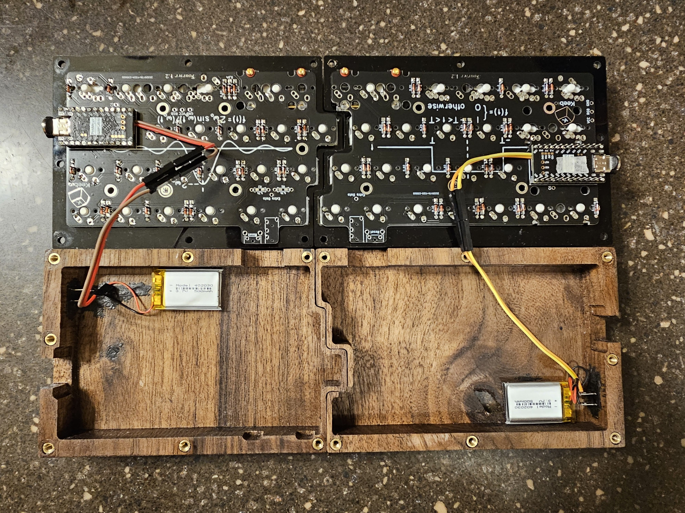
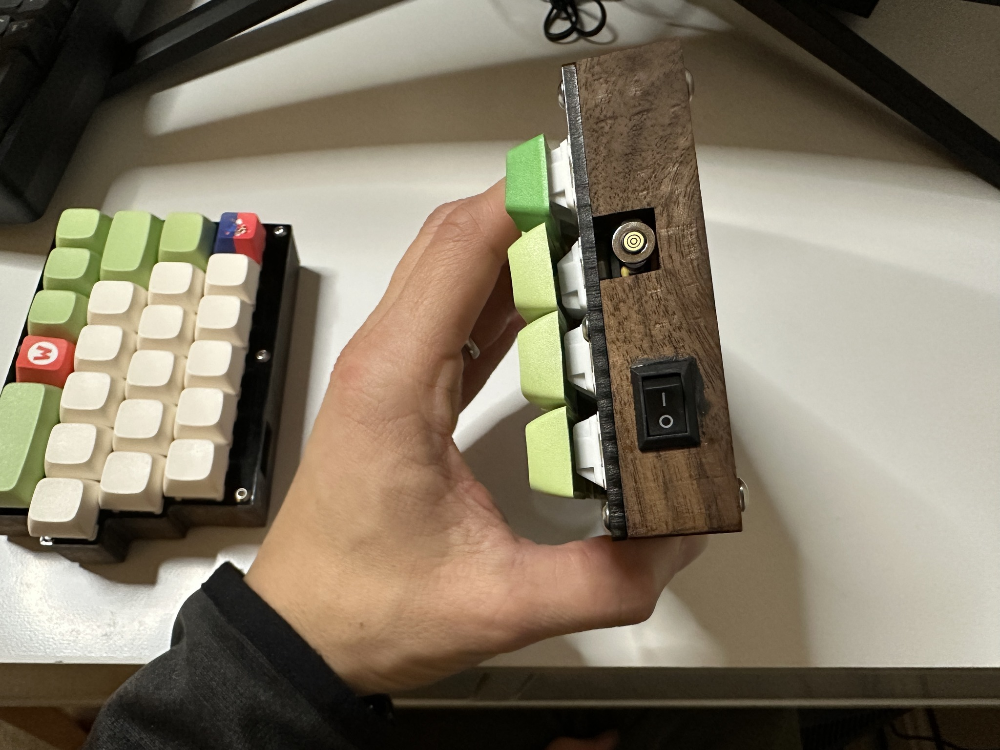
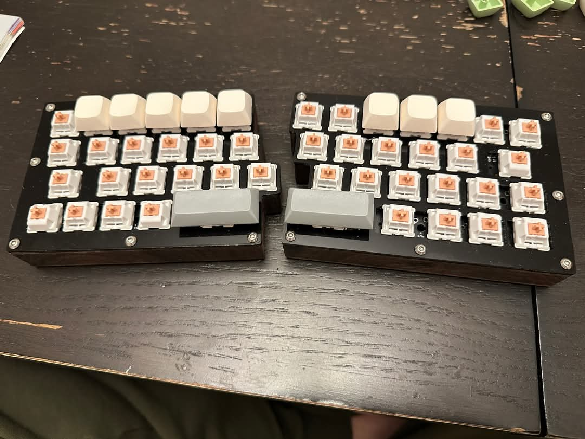
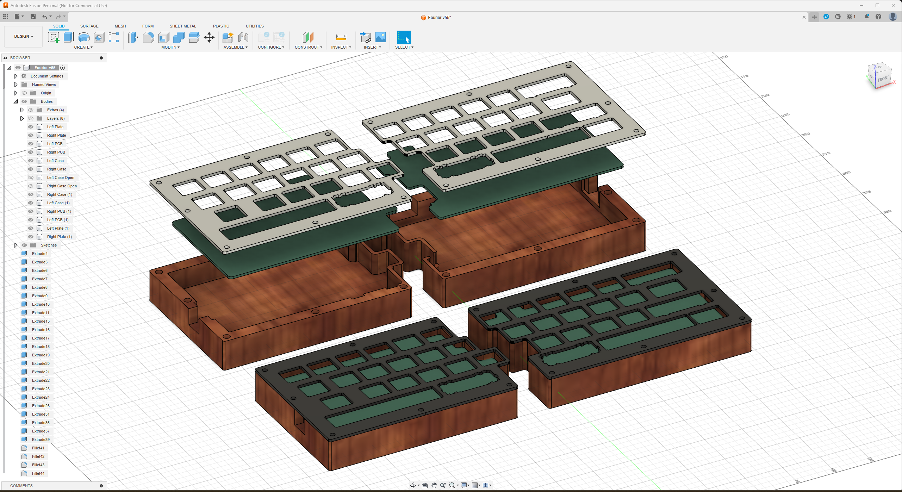
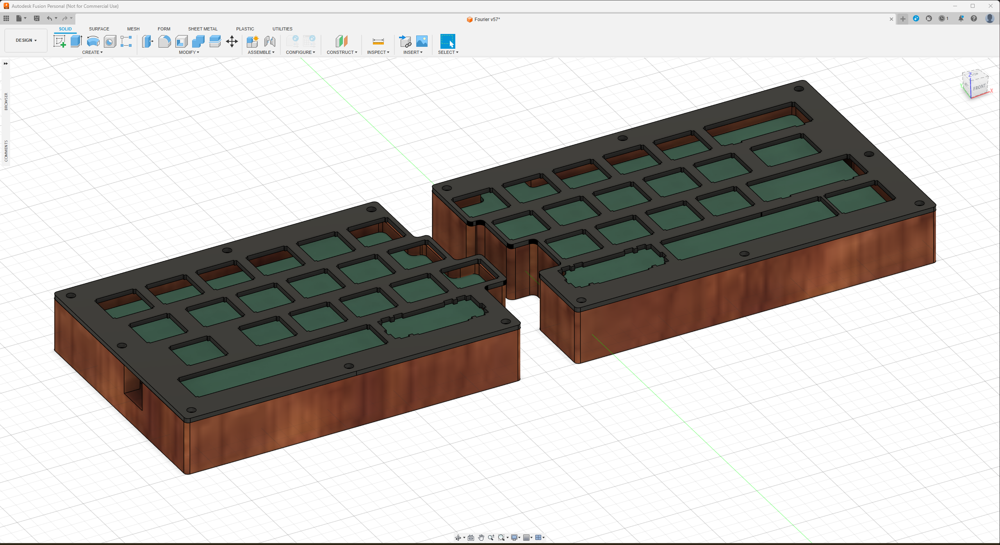
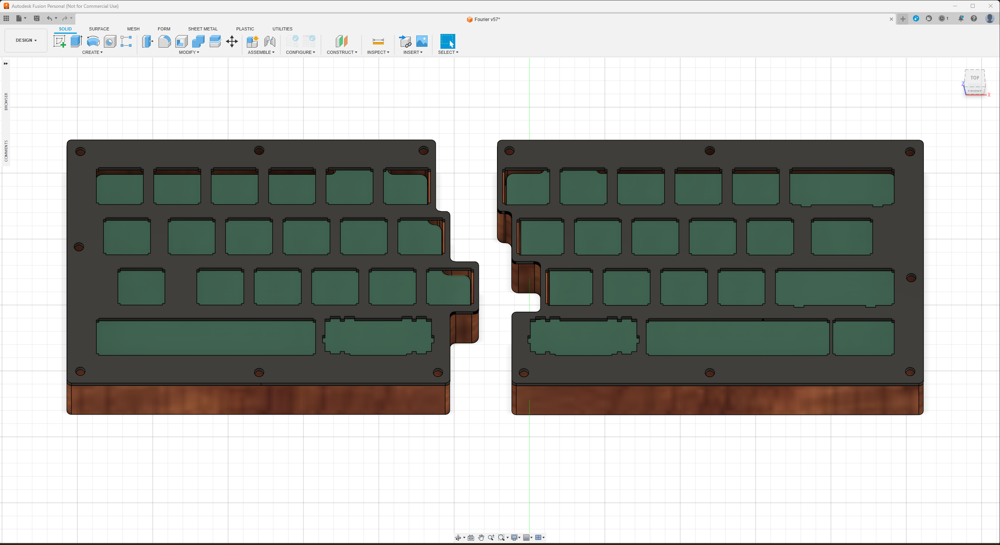
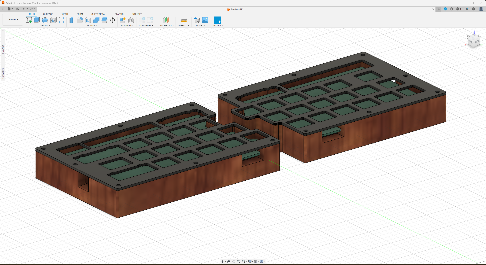

# fourier-case

I designed an enclosed case for [keebio's Fourier](https://keeb.io/products/fourier-40-split-staggered-keyboard) 40% split keyboard. This was largely modified from keebio's [fourier-case](https://github.com/keebio/fourier-case) repo. I made the case out of walnut and laser-cut the switch plate; providing the vector and STL files here in case anyone wants to make their own or 3D print instead of milling it.

Note: I moved the middle screw holes along the y-axis away from mid-point to have some clearance from the microcontroller's USB port. The original switch plate won't fit on the enclosure.

## Photos

## CAD screenshots

